# Decoy

**Mock any browser request without touching your code.**

[](https://github.com/masterghost2002/decoy/actions/workflows/ci.yml)
[](https://developer.chrome.com/docs/extensions/mv3/intro/)
[](https://www.typescriptlang.org/)
[](#testing)

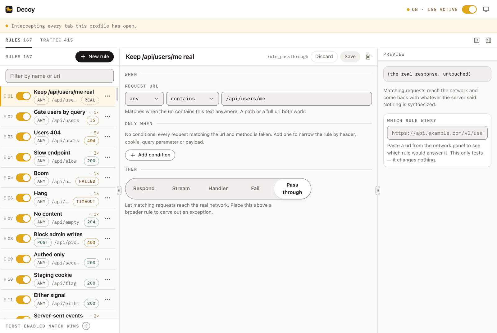

Front-end work stalls in two places: waiting for an endpoint that is not deployed yet, and
reproducing the failure cases — a 404, a 500, a 30-second response, a dropped connection. Today
that usually means editing the app to throw on purpose, then remembering to take it out again.
Decoy moves that into the browser, where it belongs: match a request by url, answer it with
whatever status, body, headers or failure you want, and flip it off when you are done.

**Status: slice 1, plus agent control.** `fetch` and `XMLHttpRequest` are fully intercepted and
verified end to end, and an agent can drive the whole of it over MCP — see
[Agents](#agents). The layers for static resources, WebSockets and scenario sharing are designed
for but not built — see [Roadmap](#roadmap).

## Quick start

```bash
git clone https://github.com/masterghost2002/decoy.git
cd decoy
pnpm install
pnpm build
```

Then in Chrome: `chrome://extensions` → enable **Developer mode** → **Load unpacked** →
select `apps/extension/dist`.

Click the toolbar icon for the popup, or the ⧉ button in it for the full-page view.
During development, `pnpm dev` rebuilds on save; press reload on the extensions page to pick the
change up.

Or skip the setup entirely and see it working against a hundred-odd rules:

```bash
pnpm playground     # a real Chrome, the extension loaded, the rule set seeded
```

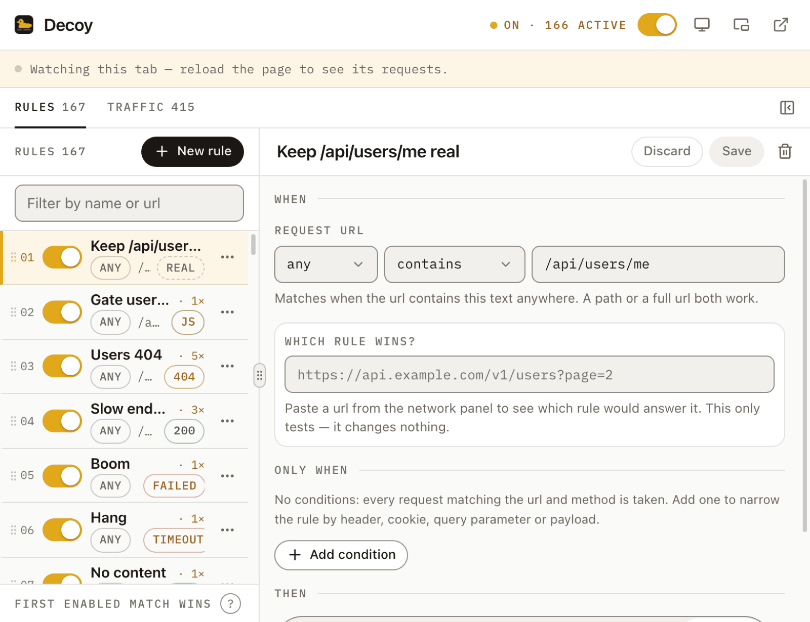

## How it works

Mocking every kind of browser request needs more than one mechanism, and the mechanisms have
genuinely different capabilities. Rather than pretend otherwise, Decoy layers them:

| Layer | Covers | Can synthesize a status + body? |
| --- | --- | --- |
| **1. Page-world patch** (built) | `fetch`, `XMLHttpRequest` | Yes — full control |
| 2. `declarativeNetRequest` (planned) | images, media, css, fonts, documents | No — block, redirect and header rewrite only |
| 3. `chrome.debugger` (planned, opt-in) | everything, at full fidelity | Yes, but shows a debugging banner and cannot attach while DevTools is open |

Layer 1 covers the overwhelming majority of front-end debugging and costs nothing: no warning
banner, and it works with DevTools open. That is why it came first.

### Request path

```
                 ┌──────────────────────── page (MAIN world) ────────────────────────┐
                 │  injected.js at document_start                                    │
  page code ───► │  patched fetch / XMLHttpRequest ──► @decoy/core matcher        │
                 │        │                                    │                     │
                 │        │ no rule matched                     │ rule matched        │
                 │        ▼                                    ▼                     │
                 │  native fetch / XHR                  synthesized response         │
                 └────────────┬──────────────────────────────────┬───────────────────┘
                              │ postMessage (traffic)            │ postMessage (config)
                 ┌────────────▼──────────── bridge.js (isolated world) ──────────────┐
                 │  batches traffic, relays config                                   │
                 └────────────┬──────────────────────────────────▲───────────────────┘
                              │ chrome.runtime                   │
                 ┌────────────▼──────────────────────────────────┴───────────────────┐
                 │  background.js — validates, persists, fans out, keeps traffic log │
                 └───────────────────────────────────────────────────────────────────┘
```

Matching happens **in the page**, not in the service worker. A round trip per request would add
latency to every call and would break whenever MV3 put the worker to sleep. The worker owns the
rules; the page owns the decision.

### Why the packages are split this way

- **`packages/core`** — the matcher, the rule contract and the response planner. Pure TypeScript,
  no DOM and no `chrome.*`. Its main entry deliberately contains **no zod**, because that entry is
  bundled into every page; validation lives behind `@decoy/core/schema` and is used only by
  the service worker and the UI. The injected bundle is 12 kB minified as a result.
- **`apps/extension`** — the MV3 surfaces: service worker, content bridge, injected script, and a
  React 19 + Vite + Tailwind 4 + shadcn UI shared by the popup and the full tab.
- **`apps/mcp`** — the MCP server, so an agent can drive Decoy while it writes the code that calls
  the endpoint being mocked. It is transport and phrasing only: every command's effect on a rule
  set lives in `packages/core/src/agent.ts`, pure and unit-tested, so the agent path and the UI
  path cannot disagree. See [Agents](#agents).
- **`playground`** — the behavioural test suite, which is also a page you can open and click
  through. No build step and no framework: it is the thing you reach for when the extension is
  misbehaving, and a bundler between you and it would be exactly the wrong complexity in that
  moment. See [Testing](#testing).

The service worker builds as three separate single-file IIFE bundles, because Chrome loads them
without a module loader and the injected script has to run at `document_start`.

### Three surfaces, one component tree

| Surface | How it opens | What it is for |
| --- | --- | --- |
| **Popup** | the toolbar button | a quick look and a quick toggle, 780 × 600 |
| **Tab** | the ⧉ button in the popup | the full three-pane workspace |
| **Floating panel** | the ⧈ button in the popup | staying open *over* the page you are debugging |

The panel exists because of a hard limitation, not a preference: a browser action popup cannot be
moved, cannot be resized, is capped by Chrome at 800 × 600, and **closes the moment you click the
page behind it**. That last one is disqualifying for the actual loop here — change a rule, click
the thing, watch what happens — because it makes you reopen the popup after every single click.

So the panel mounts the same UI into the page instead, via `chrome.scripting` on demand (a 500 kB
React bundle has no business loading on every page anyone visits). It is draggable by its header,
resizable from any edge, rounded, and remembers where you left it. Injecting it a second time takes
it away, which is how one toolbar button toggles it.

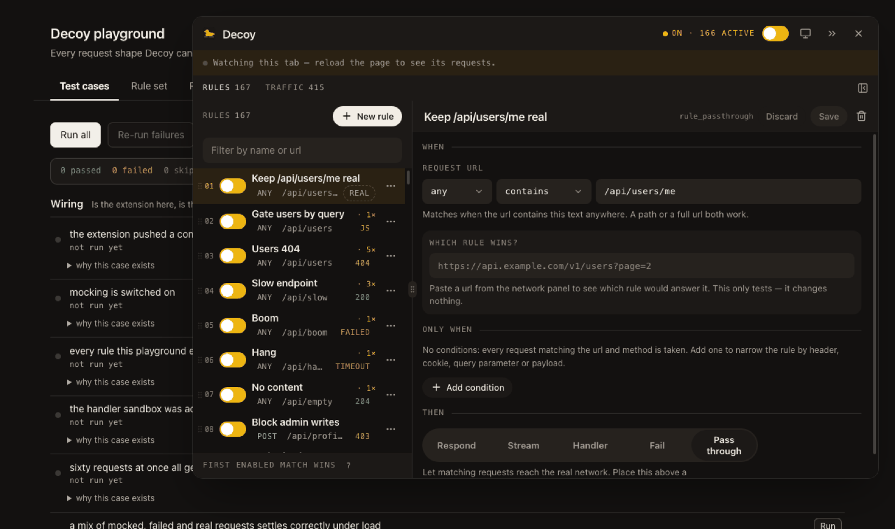

Living inside someone else's document costs four things that the popup gets for free, and all four
are handled rather than hoped about:

- **A shadow root**, so the site cannot restyle the panel and Tailwind's preflight cannot reset the
  site's margins. Every colour token is therefore declared for `:root` **and** `:host` — inside a
  shadow root `:root` matches nothing, and one missed selector means the whole palette resolves to
  nothing.
- **Portals go in the panel, not `document.body`.** Radix defaults to the body, which is outside
  the shadow root and so outside every stylesheet the panel has.
- **Keyboard shortcuts bind to the shadow root**, not `window`. A tool that swallows the host app's
  ⌘K and ⌘S is a tool you have to close in order to use the thing you are debugging.
- **The layout measures itself.** Pane counts used to come from a media query, which reads the
  *window*; a 900px panel in a 1600px window would have asked for a three-pane layout and had
  nowhere to put it.

## The rule model

A rule is a matcher plus an action. Rules are evaluated top to bottom and **the first enabled match
wins** — that is the entire priority model. No scores, no specificity heuristics; if you want a rule
to win, move it up.

```
match:  url (contains | equals | startsWith | endsWith | wildcard | regex)
        methods (any, or a specific set)
        conditions (all | any of):
            header <name>     cookie <name>    query <name>
            body              body json <dotted.path>
          × is present | is missing | equals | contains | starts with | ends with
            | matches regex | is greater than | is less than

then:   respond       status 200-599, headers, json/text/empty body, delay
        stream        the same head, but the body arrives in chunks:
                      sse | ndjson | text framing, an interval, a repeat count
        fail          failed (TypeError) | timeout (hangs) | aborted (AbortError), delay
        pass through   let this one reach the real network
```

Url and method decide *which endpoint*; conditions decide *which call to it*. "This POST,
but only when the payload's `user.role` is `admin`" cannot be said any other way, and it is a
common thing to want:

```
match:  /api/profile · POST · body json  user.role  equals  admin
then:   respond 403
```

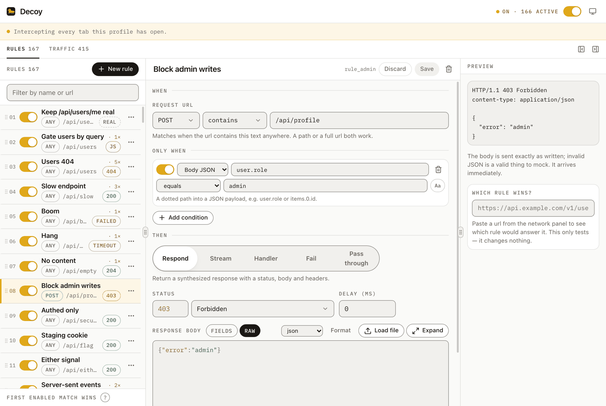

Every other POST to the same url is left alone. Conditions are evaluated in the page, after the
url and method have already matched, so the cost only lands on requests that got that far. A rule
with no conditions behaves exactly as it did before conditions existed.

`pass through` exists so you can carve an exception out of a broad rule: put
`/api/users/me → pass through` above `/api/users → 404` and only the narrow one stays real.

Some deliberate decisions worth knowing:

- **Bodies are stored as raw strings and never reformatted.** Invalid JSON is a legitimate thing to
  mock, so the editor warns about it and sends it anyway. The body editor opens full screen with a
  find bar, because a JSON fixture is the one thing here that genuinely needs room. It also has a
  **fields** view — name, type, value, one row each — which is a *view over the same string*, not a
  second storage format: nothing is migrated, `raw` is always the truth, and a body that fields
  cannot describe (an array, a bare scalar, something invalid) says so instead of flattening it.
- **A url pattern without a scheme still matches.** The traffic panel displays urls as
  `api.example.com/v1/users`, so that is what people paste. Before, every anchored mode --
  `equals`, `startsWith`, `wildcard` -- silently failed on it, which read as "this tool does not
  accept a full url with a domain". A pattern that does name a scheme is still matched literally,
  so precision stays available. `startsWith` is deliberately *not* widened to bare paths;
  `contains` is the mode for that, and it is the default.
- **A streamed body is a different thing to test than a slow one.** `respond` hands over a
  finished string, so it cannot reproduce progressive rendering, a reconnecting event source, or a
  client that gives up halfway. `stream` sends a list of chunks on an interval instead, framed for
  the format you pick — `sse` adds the `data:` prefix and the blank line that ends an event,
  `ndjson` compacts each record onto its own line — and shows you what each chunk becomes on the
  wire underneath the box you typed it in. `repeat: 0` never closes, which is the honest way to
  mock an endpoint that is not supposed to end. Over `fetch` it is a real `ReadableStream`; over
  XHR the chunks surface as `progress` events with `responseText` growing underneath them, and a
  `xhr.timeout` still cuts off a body that had already started arriving.

  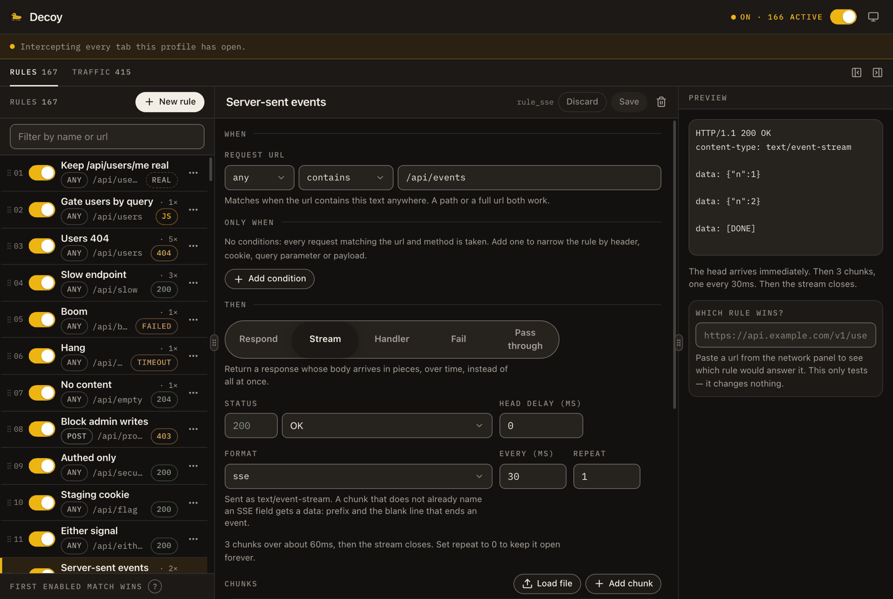
- **A handler is real JavaScript, in every shape people write it.** A bare body of statements is
  the documented form and can `await`; so can `async (req, res) => …`, `export default async
  function handler(req, res) {…}` and `module.exports = function (req, res) {…};`. Someone who has
  written a route handler before should be able to paste one, and meeting them with
  `SyntaxError: Unexpected token 'export'` teaches nothing about a tool whose selling point is that
  it takes real code.

  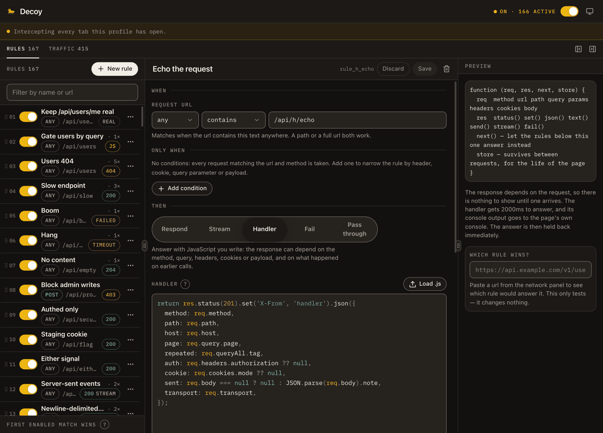
- **A capture on disk can be played back without being retyped.** Load or drop a file into the
  chunk list and it is split where the format frames it -- an SSE event at the blank line that
  ends it, an ndjson record per line, text per line with the newline kept -- so playing it back
  reproduces the file rather than a rearrangement of it. The format is read off the file first,
  because the split depends on it and an ndjson capture loaded as `sse` becomes one useless chunk
  holding the whole thing. A response body takes a file the same way. Both are undoable from the
  toast, and both are capped: every rule lives in one `chrome.storage.local` key, so a dropped-in
  log file is not allowed to grow the config past the point where nothing can be saved.
- **Delays interact with client timeouts properly.** A mocked XHR never touches the network, so its
  native `timeout` would never fire; Decoy emulates it. Set `xhr.timeout = 300` against a
  1500 ms mock and you get a real `timeout` event.
- **`responseText` throws for binary response types**, exactly as the platform does. A mock that is
  more forgiving than the network hides bugs instead of finding them.
- **Every request is logged, not just the mocked ones.** "My rule didn't fire and I can't see why"
  is the fastest way for a tool like this to waste an afternoon, so the traffic panel shows
  passthrough, mocked and failed requests alike, and the rule editor has a *Does this pattern
  match?* box that answers yes/no against the pattern you are editing.
- **Clicking a request opens what the page actually sent** — request headers, the serialized
  payload, and the response headers — so "what did my app send?" does not send you back to the
  DevTools network panel. Payloads are capped at 64 kB for capture; the real request is
  unaffected.

  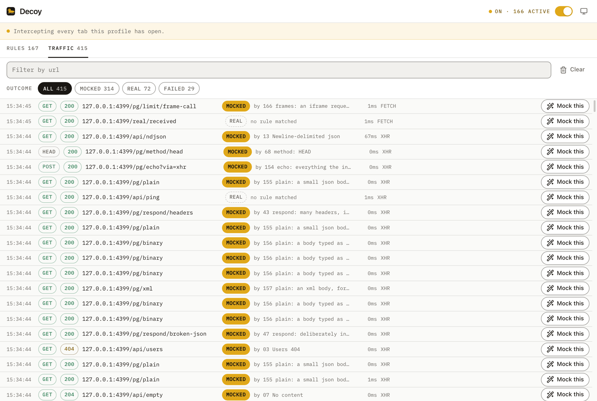

  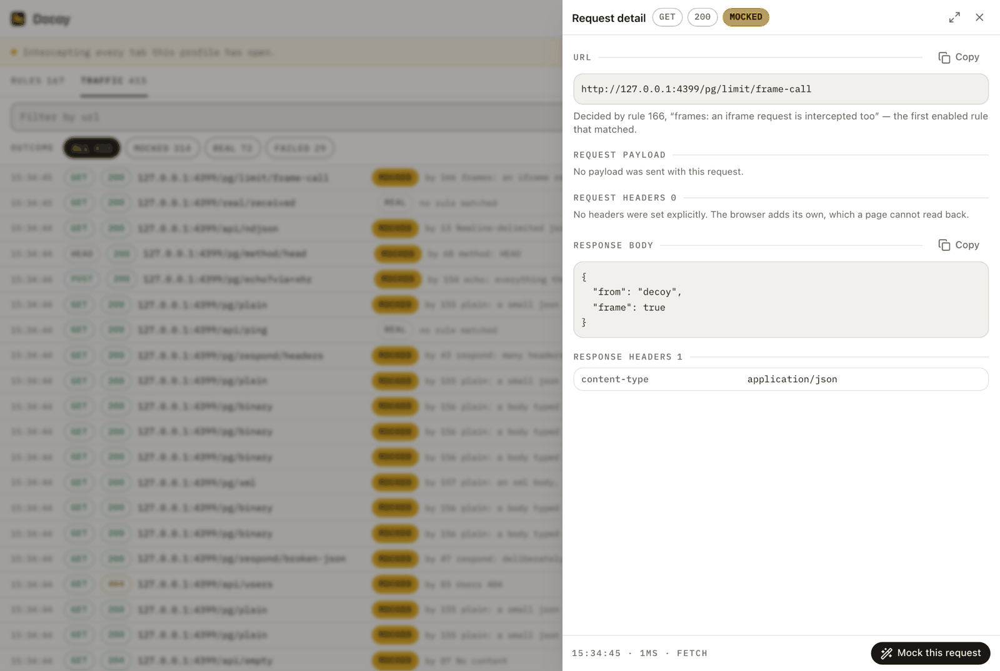
- **Each rule shows how many times it has fired**, so "is this thing even doing anything?" is
  answered by the list rather than by guesswork. Counts live in session storage and survive an
  MV3 worker restart; the toolbar badge shows the mocked count for the active tab.
- **Aborted and timed-out requests are logged too**, since those are usually the ones you are
  chasing.

## Design

The surface is deliberately quiet, because it sits next to DevTools and gets read at a glance
rather than admired. Quiet is a matter of size, weight and density — never of fading text below
the legibility floor.

- **Warm neutrals, one accent, one meaning.** A near-black ink with a brown cast (`#1A1714`), paper
  surfaces, and goldenrod as the only accent. Gold means exactly one thing — *requests are being
  intercepted* — so it is spent on the master switch, the per-rule switch and the `mocked` outcome,
  and nowhere else. Selection, primary actions, active tabs and the focus ring are ink and neutral.
  Screenshot any surface and count the gold: if one element is not about interception, it is a bug.
- **Gold comes in three variants**, because one token cannot do three jobs. `--gold` is a fill and
  is never used for type on paper (2.15:1). `--gold-text` is its typographic sibling at 4.55:1.
  `--on-gold` is the ink that goes *on* the fill, and it deliberately does not flip with the theme,
  because `--gold` does not either.
- **Colour carries category, not hierarchy.** Methods and status classes are outlined mono pills
  with their own colours (GET green, POST blue, DELETE red, 4xx amber, 5xx red), so a row is
  readable without a legend. The number or word is always present too — colour is never the only
  signal.
- **Mono micro-labels.** Field labels and section eyebrows are uppercase IBM Plex Mono at 10px with
  wide tracking, which lets headings stay small and the content stay dominant.
- **Three line weights, because "a line" is two jobs.** `--hairline` and `--hairline-strong` are
  structure — dividers, card rings, the outlines on static pills — and are decorative. `--edge` is
  the boundary of an interactive control, where the line is the only thing saying "this is a
  control", so it clears 3:1 against every surface. That needs roughly twice the alpha, which is
  why it is a separate token rather than a heavier hairline applied to everything.
- **Nothing that matters lives behind hover.** Core actions are always visible; rare and
  destructive ones live in an always-visible `⋯` menu. Take a screenshot with no cursor on the
  page — every action a user needs has to be in it.
- **Explanations sit at the point of decision.** Anything that changes behaviour gets one line of
  always-visible helper text under the control. The `title` attribute is not an information
  channel: it waits a second, never appears on keyboard focus, is invisible on touch and is
  announced inconsistently. Tooltips name icon-only buttons and do nothing else; a click-triggered
  `?` popover is reserved for the priority model and wildcard/regex syntax.
- **Both themes ship**, following the OS, with an in-app override in the header. `pnpm e2e` with
  `E2E_SCREENSHOT_DIR` set renders every surface in both so a change can be reviewed rather than
  assumed.

  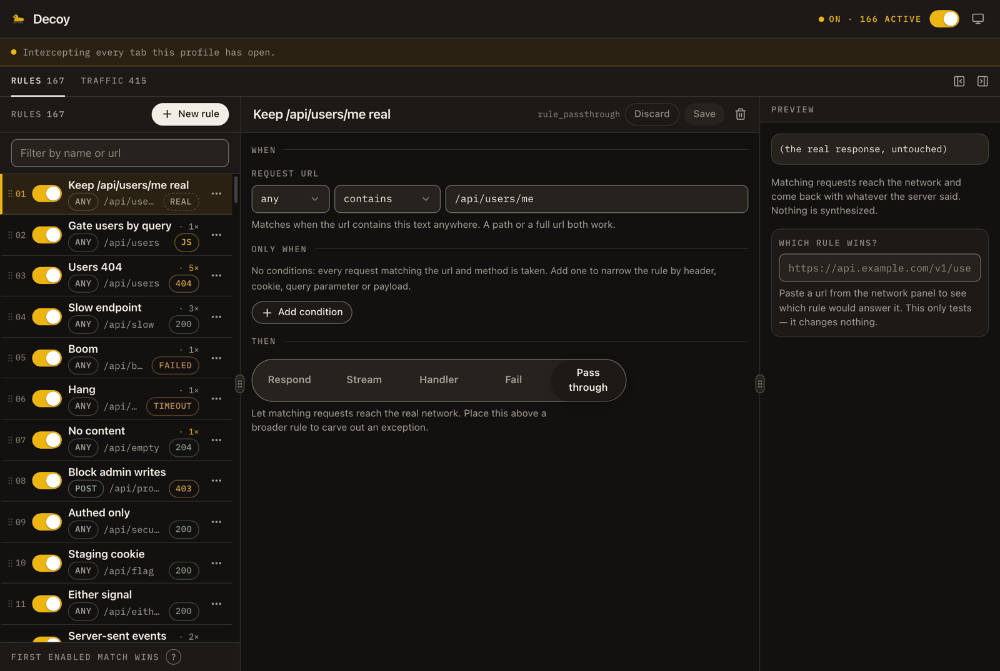

Tokens live in `src/ui/styles.css` as CSS variables mapped into Tailwind's theme, so a palette
change is one file. `eyebrow`, `helper`, `tabular` and `hit-28` are custom utilities.

`pnpm --filter @decoy/extension contrast` parses those tokens back out of the stylesheet and
checks every pair that carries type against 4.5:1, and every control boundary against 3:1. It runs
as part of `build`, because the last two regressions it would have caught were both invisible by
eye: a label at 2.43:1, and an ink that read correctly in one theme and at 1.56:1 in the other
because it flipped with the theme while the fill under it did not.

### Nothing moves under the cursor

Layout shift is treated as a defect, not a detail, because every surface here is read while you are
already pointing at something on it.

- The **page-scope strip** is always rendered at one fixed height. Pausing swaps its words and puts
  **Resume** inside it; the first request arriving swaps them again. The tabs and the list below
  never move.
- **Worker errors go to the toast layer**, an overlay, rather than inserting a red bar between the
  tabs and the panel at the exact moment something has gone wrong.
- The **rules filter is unconditional.** It used to appear once the list passed six rules, so adding
  a sixth rule pushed the whole list down.
- The **fired stamp** collapses from `fired 2s ago · 14×` to `· 14×` by container width rather than
  viewport width, so the same list can be dense in a 300px pane and generous in a wide one
  without either one reflowing.

### The split is yours to make

The tab view is a list you scan, a form you fill in, and a preview you check, all competing for the
same screen — and which one deserves the room changes with what you are doing. Writing a long json
body wants the middle; comparing eleven rules wants the left. No fixed set of column widths is right
for both, so the separators are draggable (shadcn `resizable`, on `react-resizable-panels`), either
side pane folds away from the toolbar, and the split is remembered.

Only the middle pane scrolls as a pane. The two beside it are pinned headers over their own
scrolling regions, so they hold still while the form between them is being read.

### Answering "is it working?"

Decoy intervenes in someone else's page, so its first job on every surface is evidence —
configuration state is not evidence. Four signals, at four distances:

| Distance | Signal |
| --- | --- |
| Browser chrome | **Toolbar badge** — count of mocks on the active tab, cleared on navigation, grey when paused |
| Popup header | **Page-scope strip** — `app.local · 12 requests · 9 mocked · 2 rules fired`, with a pulse on each interception |
| Rule row | **Fired stamp** — `fired 2s ago · 14×`, decaying to a plain count after a minute |
| Traffic row | **Named decider** — `MOCKED by 02 Users 404`, as visible text |

### Mock this

The fastest path through the product is: see a real request in **Traffic**, press **Mock this**,
change one field, reload. For that to be one edit rather than twenty, the new rule is prefilled with
what the endpoint actually returned — its status, its response headers, and its response body,
pretty-printed when it is JSON and left verbatim when it is not.

Reading a real response body is the only part of this that is not free. It is taken from a
`clone()` of the response, never awaited on the request path, capped at 64 kB, skipped entirely for
opaque and non-textual responses, and delivered as a follow-up message keyed to the traffic entry —
so the page's own `fetch` is not slowed down and the log stays live while the body is still
arriving. Headers that describe one particular transfer rather than the response (`content-length`,
`content-encoding`, `date`, `set-cookie`, …) are dropped rather than copied into a rule where they
would be wrong.

The other half of the question is *why didn't my rule fire?*, and the answer is
**shadow detection**: when an earlier enabled rule provably matches everything a later one does,
the row says `never fires — 01 matches everything this rule does` and offers **Move above 01**.
It is computed from the matchers in `packages/core/src/shadow.ts`, and the bar there is soundness
rather than coverage — wildcard and regex haystacks are skipped rather than guessed at, because a
false badge on a working rule is worse than staying quiet. The match tester answers the same
question from the other direction: paste a url and it names the rule that wins, not merely whether
this one matches.

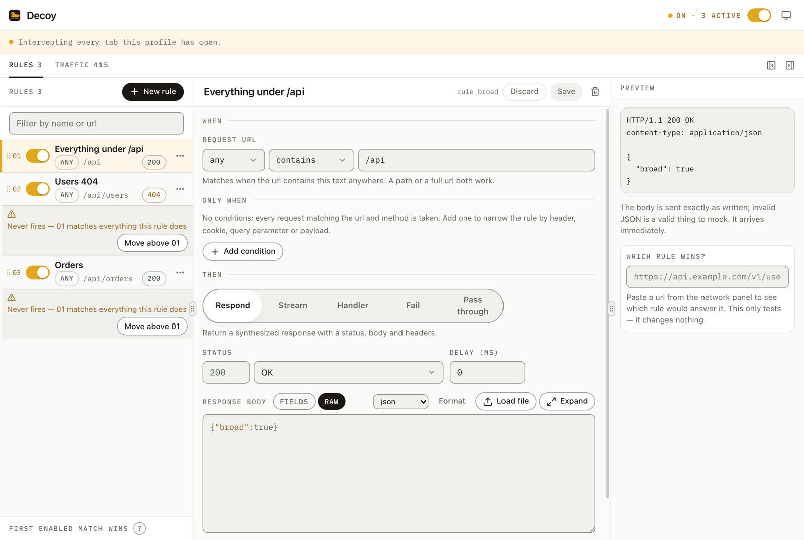

## Agents

An agent building a feature already knows the shape it expects back, long before the endpoint
exists. Decoy is how it says so — and how it reads back what the page actually asked for when the
answer turns out to be wrong.

```bash
# In Chrome: Decoy → the agent button → switch Agent control on, and copy the block it shows.
```

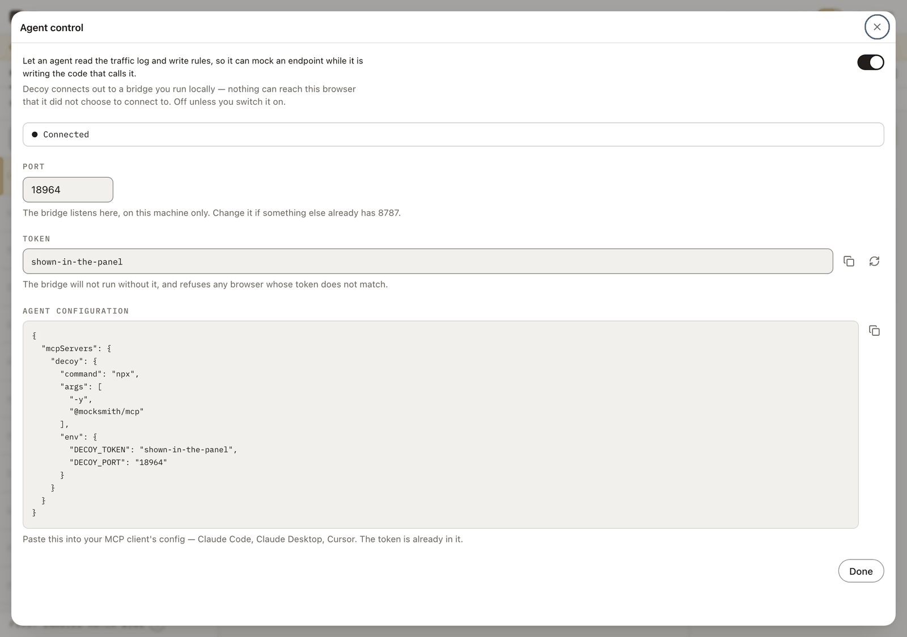

```json
{
  "mcpServers": {
    "decoy": {
      "command": "npx",
      "args": ["-y", "@decoy/mcp"],
      "env": { "DECOY_TOKEN": "…", "DECOY_PORT": "8787" }
    }
  }
}
```

Twelve tools, in the same vocabulary the UI uses: list, get, create, update, enable, move and
delete rules; pause or resume mocking; read and clear the traffic log; and ask which rule would
answer a given url. A rule is described the way someone would say it rather than the way it is
stored:

```json
{ "url": "/api/users", "methods": ["GET"], "respond": { "status": 200, "json": { "items": [] } } }
```

### How it is wired, and why that way

```
agent  ──stdio/MCP──▶  decoy-mcp  ◀──WebSocket──  Chrome service worker
                       127.0.0.1                   (dials out; never listens)
```

The direction is forced, and turns out to be right twice over. An MV3 service worker cannot listen
for connections — but it can open one, so the browser decides what it talks to rather than
accepting whatever arrives. And an open socket resets the worker's idle timer, which quietly solves
the other MV3 problem: a worker that goes to sleep in the middle of a conversation.

Three things guard it, because a socket that can rewrite what your app sees is not something to
enable quietly:

- **Off by default**, switched on in the extension. The side granting permission is the side that
  mints the secret; the bridge only ever learns the token because a person pasted it into their own
  agent's config.
- **Loopback only.** There is no case where the agent and the browser are on different machines.
- **A token on every connection.** A mismatch is closed with `4401`, which the extension reads as
  *stop retrying and say why* rather than flapping. The end-to-end run asserts exactly that: a
  bridge with the wrong token never gets a browser.

Everything an agent sends is validated by the same schema the UI's own writes go through, and a
rule the worker refuses is reported rather than dropped — an agent told its rule was written when
it was not will confidently build on top of that.

There is deliberately no gold anywhere on the agent surface. Gold means one thing in this product —
requests are being intercepted — and an agent being connected is not that.

## Testing

```bash
pnpm typecheck                              # every package
pnpm test                                   # 248 unit tests
pnpm --filter @decoy/extension contrast     # the palette's contrast floors
pnpm playground                             # the playground, in a real Chrome, rules seeded
pnpm --filter @decoy/extension e2e          # 253 checks, headless
```

There are two layers, and the split is on purpose. Unit tests cover what is pure — the matcher, the
response planner, config validation, shadow detection, handler compilation, the page-scope summary
and the editor's rule transforms. Everything else is behaviour in a real browser, and that lives in
**the playground**.

### The playground

`playground/` is a page that exercises every request shape Decoy can answer, against a real server,
with the real extension loaded. It is one artefact with two ways in:

```bash
pnpm playground                             # opens it, with the rule set already seeded
pnpm --filter @decoy/extension e2e      # runs the same cases headless, and asserts
```

`pnpm playground` launches a Chrome with the built extension, seeds the 167 rules the cases expect,
and opens two tabs — the playground and Decoy's own workspace — so you can change a rule in one and
watch it take effect in the other. There are four surfaces: **Test cases**, **Rule set** (what is
seeded, and what is missing), **Request bench** (one request, any method, headers and body, over
`fetch` or either flavour of XHR), and **Generate traffic** (bursts, trickles, oversized payloads —
for watching the traffic log rather than asserting on it).

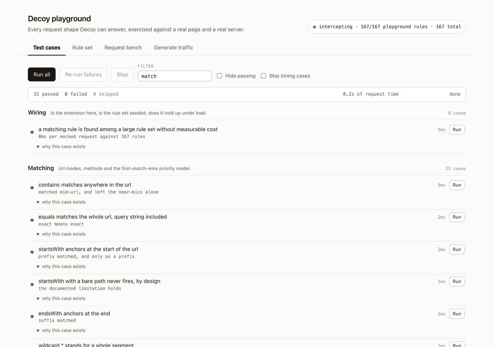

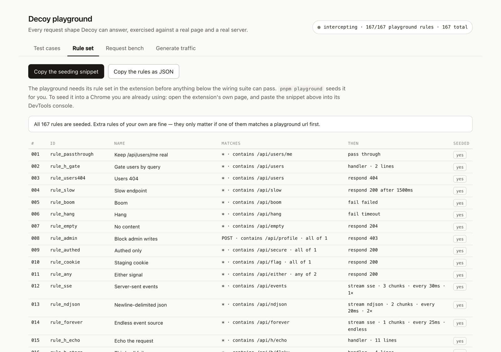

198 cases in ten suites:

| Suite | What it pins down |
| --- | --- |
| **wiring** | the config reaches the page, the rule set is seeded, 60 concurrent calls never cross |
| **match** | all six url modes with a near-miss each, case sensitivity, methods, first-match-wins, shadowing |
| **respond** | every status class, reason phrases, header repeats, all three body types, delays |
| **cond** | five sources × eleven operators, `all`/`any`, and every body shape the page can serialize |
| **stream** | sse/ndjson/text framing, intervals, repeats, endless streams, and the same over XHR |
| **fail** | `failed` / `timeout` / `aborted`, abort reasons, `AbortSignal.timeout`, xhr timeouts |
| **handler** | the whole `req`/`res` contract, `next()`, `store`, four source shapes, and five ways to crash |
| **fetch** | Request and URL inputs, the Response surface, clone, readers, concurrency, cross-origin |
| **xhr** | readyState and event order, every `responseType`, sync requests, instance reuse |
| **limits** | what is deliberately *not* intercepted — images, css, EventSource, WebSocket, workers, beacons |

Three properties make it worth trusting rather than just running:

- **Every case is independent and re-runnable.** Anything stateful is keyed by a nonce or cleaned
  up after, so clicking a case twice gives the same answer, and so does running the list in any
  order. A case that hangs is cut off by a watchdog rather than taking the run with it.
- **A missing rule skips; it does not fail.** The page reads the live config off the bridge — which
  a page can do, and which is documented under [Security notes](#security-notes) — so a case whose
  rule was never seeded says *not seeded* instead of *broken*. Red always means a regression.
- **Negative cases everywhere.** Almost every case asserts both halves: that the matching request
  was intercepted *and* that the near-identical one reached the network. A rule that matched
  everything would satisfy only the first.

The limits suite is the unusual one. Each case puts a rule on a url and then proves the real
resource still loaded — a real 1×1 png, a real stylesheet whose value is read back out of
`getComputedStyle`, a real event stream, a real WebSocket echo, a real worker fetch, a beacon the
fixture server confirms receiving. Nothing in [Known limits](#known-limits) is a promise; all of it
is a test that would turn red the day a layer started covering it.

### The end-to-end run

`pnpm e2e` runs all 198 playground cases headless and then keeps going, into the parts only a real
browser can answer: it loads the extension's own UI and checks that the rules and the traffic those
cases produced both render, that **Mock this** seeds a rule that survives validation, that a
dropped-in capture splits into one chunk per record, that the rule lifecycle — create, rename, save,
duplicate, reorder, disable, delete, undo — writes through the worker and comes back. Finally it
injects the **floating panel** into a live page and asserts the things a shadow root makes fragile:
that it mounts, that a colour token declared on `:host` resolves inside it, that the corners stay
rounded, that the detail sheet lands inside the shadow root rather than in the page, and that a
second toggle takes it away again.

It finishes on the agent bridge, driving the *real* one out of `apps/mcp/dist` rather than a stub
that could still speak an older protocol. The unit tests prove the handshake and the command logic;
only this proves the service worker actually dials out — so it writes a rule over the socket,
checks the page sees it without a reload, checks it landed in the real config, reads it back out of
the traffic log, deletes it, and confirms a bridge holding the wrong token never gets a browser at
all.

> **E2E needs a Chrome for Testing build.** Chrome 137+ ignores `--load-extension` on the stable
> channel, so an installed Chrome cannot load an unpacked extension from the command line. The
> script finds a build already cached by Playwright or Puppeteer; otherwise run
> `npx playwright install chromium`, or set `CHROME_PATH`. `pnpm playground` needs the same build,
> and says so — with instructions for using a Chrome you already have instead.
>
> `E2E_HEADED=1` watches it happen. `E2E_SCREENSHOT_DIR=./shots` writes PNGs of each UI surface in
> both themes — including the states nothing else exercises: a shadowed rule, the paused list, first
> run, the match-mode listbox open, the stream editor, the body fields view, the method multi-select
> open, a dirty editor with its unsaved-changes bar, and the floating panel over a live page.

The playground page is served under a deliberately hostile content security policy — `script-src
'self'` with no `unsafe-eval`, and `frame-src 'self'` — because that is what a hardened app looks
like, and handlers have to work inside one. Every handler case is therefore also a test that the
sandbox architecture is doing its job.

## Known limits

Honest list, so nobody debugs a limitation as if it were a bug:

- Only `fetch` and `XMLHttpRequest` are intercepted. Images, media, stylesheets, documents,
  WebSockets and `EventSource` reach the network untouched. A `stream` rule therefore mocks an
  event stream read with `fetch` or XHR, but not one opened with `new EventSource(...)` — that
  constructor never goes through either patch.
- Requests made by a page's own service worker or in a dedicated worker are not intercepted; the
  patch is installed in the page's main world only.
- A 1xx status cannot be mocked. The Fetch spec refuses to construct such a `Response`, and it is
  not observable to `fetch` or XHR anyway, so the rule schema stops at 200.
- `Set-Cookie` on a mocked response is dropped by the platform's own header guard, and would not
  set a cookie regardless.
- The traffic log lives in the service worker's memory. MV3 may terminate the worker, which clears
  it; the rules themselves are persisted.
- Requests made in the first few milliseconds of a page load wait up to 1 s for rules to arrive,
  then pass through rather than stall the page. A truly synchronous XHR cannot wait at all and
  decides with whatever rules are already known.
- The rule editor saves explicitly. Toggles apply immediately, but a half-typed url pattern should
  not hijack traffic, so edits need **Save** — or `⌘S`. The enabled Save button is the signal; there
  is no banner, because one would move the form under your cursor on every keystroke.
- **Conditions only see what the page can see.** `HttpOnly` cookies are invisible to
  `document.cookie` and so cannot be matched on. Request headers the browser adds itself — `Cookie`,
  `Origin`, `User-Agent`, `Referer` — are not readable either; only headers the calling code set
  explicitly are. A body sent as a `ReadableStream` is not read, because consuming it would break
  the request, and a `Blob` body on a synchronous XHR is skipped for the same reason.
- Rule hit counts live in session storage, so they reset when the browser restarts, and the
  per-tab badge count resets on navigation.
- Shadow detection is sound, not exhaustive. It reports only what it can prove from the matchers,
  so a rule shadowed through a wildcard or regex pattern is not flagged. It will not tell you a
  working rule never fires.

### Security notes

`window.postMessage` is the only channel between the page world and an isolated content script, so
a host page can observe the config pushed to it and the traffic reported back. The page already
made every request being reported, and a forged config message could only change how that page's
own requests are answered — no cross-origin reach and no extension privilege. It is worth knowing
before you enable Decoy on a page you do not trust.

The extension asks for `storage`, `scripting`, and `<all_urls>` host access, and nothing else.
`<all_urls>` is inherent: a tool that mocks any request has to be able to run on any page.
`scripting` is what injects the floating panel into the tab you ask for it in, on demand — it is
not used to put anything on a page you did not ask for.

**Agent control adds a socket, and it is off until you switch it on.** When on, the service worker
opens one outgoing WebSocket to `127.0.0.1` and authenticates with a token this extension generated
and showed you. Anything holding that token can read the traffic log and rewrite the rules, which
is the same power the UI has and no more — no cross-origin reach, no extension privilege, nothing
outside this machine. Rotating the token in the panel invalidates whatever it was pasted into.

## Roadmap

Ordered by how much each unblocks:

1. **Scenarios** — named sets of rule overrides, one active at a time, so "logged out", "empty
   state" and "server on fire" become one click each instead of six toggles.
2. **Record then replay** — capture a real response once and turn it into a mock, which is the
   direct answer to "the backend is not deployed yet".
3. **WebSocket and `EventSource` mocking** — a scriptable virtual server: message timelines,
   pattern-matched replies, close codes, reconnect storms. The `stream` action already covers an
   event stream read through `fetch` or XHR; what is left is the two APIs that never touch either
   patch. The page-world patch is the only mechanism that can inject frames, so this builds on
   layer 1.
4. **Layer 2 (`declarativeNetRequest`)** — block, redirect and rewrite headers for images, media,
   fonts, css and documents.
5. **Import** — Postman collections, OpenAPI specs and HAR files into rules, with AI-generated
   example bodies.
6. **Sharing** — export/import a config file first, then a small service so a team shares scenario
   sets instead of screenshotting them.
7. **Layer 3 (`chrome.debugger`)** — opt-in deep mode for true status + body control over any
   resource type, with a clear fallback when DevTools is already attached.

## Contributing

```bash
pnpm install
pnpm check                                  # format, lint, typecheck and unit tests
pnpm build && pnpm e2e                      # the browser run
```

`pnpm check` is exactly what CI runs for the static jobs, so a clean local run is a clean CI run.
Formatting is Prettier's and linting is ESLint's; neither is negotiated in review. Markdown is
deliberately outside the formatter — the prose is wrapped by hand at the width it reads best.

Two conventions worth knowing before the first pull request:

- **Comments say why, not what.** The code says what it does. A comment earns its place by
  recording the decision behind it — the thing the next reader would otherwise have to rediscover
  by breaking it.
- **Behaviour goes in the playground, not in a new harness.** A change to what Decoy does gets a
  case in `playground/suites/`, which makes it both a CI assertion and something a person can click.
  See [playground/README.md](playground/README.md).

## Licence

MIT. See [LICENSE](LICENSE).
